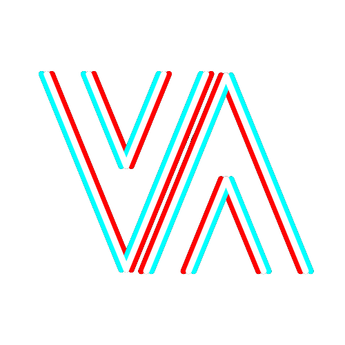

<div align="center">
  <a href="https://github.com/g4n3sha5/MatiVAted">
    
  </a>
</div>

# Mativated: Refactor
I'm excited to introduce the newest release of [Mativated](https://github.com/g4n3sha5/MatiVAted) now powered by React (Vite), TypeScript, tRPC, and Express.js as the core technologies. It also utilizes Prisma as its ORM, MySQL as its database, and Clerk as its authentication solution.  
Thanks to this stack, the app is fully typesafe. This rebuild marks a significant leap forward, ensuring a seamless and reliable experience for users.

By capitalizing on this technology stack, I've been able to focus on what truly matters: refining the app's core features and performance. Building upon the existing layout has allowed me to dive straight into coding, prioritizing code quality, avoiding unnecessary design iterations, and enabling a more efficient development process.

Backend will be deployed soon.

## Concept

As numerous studies have shown, monitoring your progress and tracking your habits make us significantly more prone to improve our behaviour and progress faster. Small wins are massive motivators, but we need to recognize them. This project provides utilities for people who love sport - especially grappling Martial Arts.


## About

I created the project inspired by literature about habits, as Jiu-Jitsu is my passion and I didn't know any app for this martial art -  I decided to create one - primarily to keep a record of my trainings. Following this idea I did:

- Concept
- Logo
- Name
- Colors and Typography
- Landing page and general UI & UX design

 MatJournal 
- Dashboard (Statistics)
- Add Session (Save Session type, length, techniques learned etc.)

And much more to come soon as I progress with the code.
## Screenshots

[](https://postimg.cc/1ffxn9xx)

[](https://postimg.cc/vDczxpF6)


## Tech Stack

**Client:** React,  Vite, React-hook-form, shadcn, TailwindCSS, React Router, React Query, Clerk, tRPC

**Server:** Node, Express, TypeScript, Prisma, tRPC


## Run Locally

Clone the project

```bash
  git clone https://github.com/g4n3sha5/mativated-monorepo
```

Go to the project directory

```bash
  cd mativated-monorepo
```

Install dependencies


Clone the repo, install dependencies with
pnpm install

run client and server with  
 turbo run dev


```bash
  pnpm install
```

Start the client

```bash
  pnpm run dev
```

Start the server if needed

```bash
  pnpm run server
```
## 🚀 About Me
I'm a front-end oriented full-stack developer with great passion for programming.
I want to become Jiu Jitsu national champion, and I am everyday closer to my goal. Mativated is supporting me in this journey since 2023, but I'm not fully satisfied with the previous version and its technology stack, that's why I remake it.
This refactor is so far my best Developer Experience leveraging the power of React + TypeScript combined with tRPC + Prisma + Zod I made this app.


